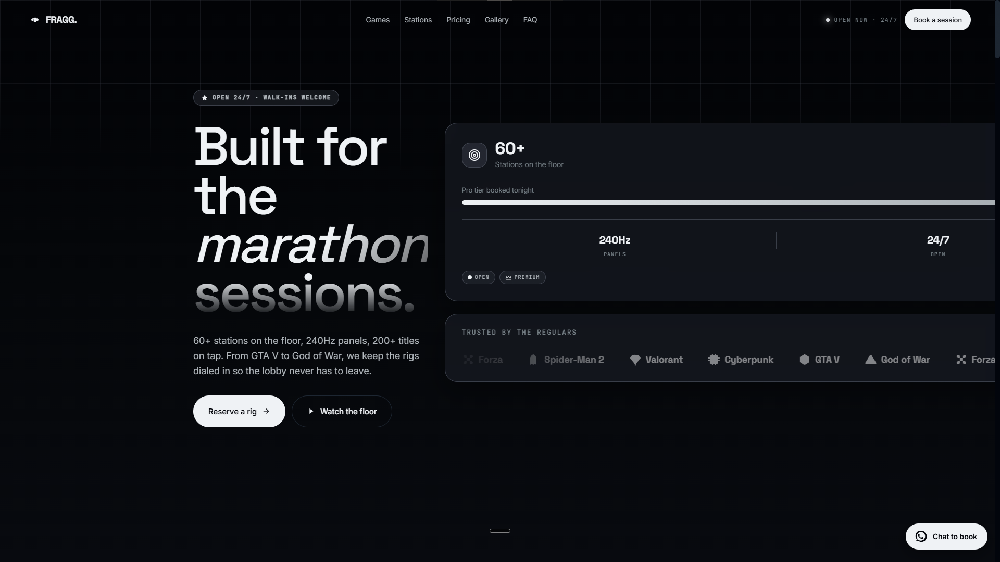
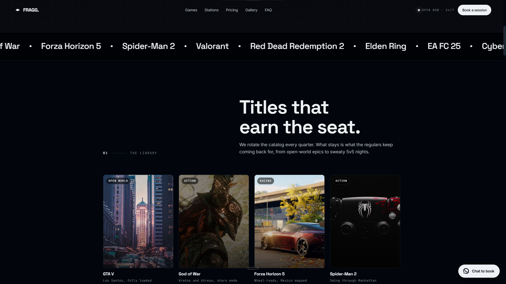
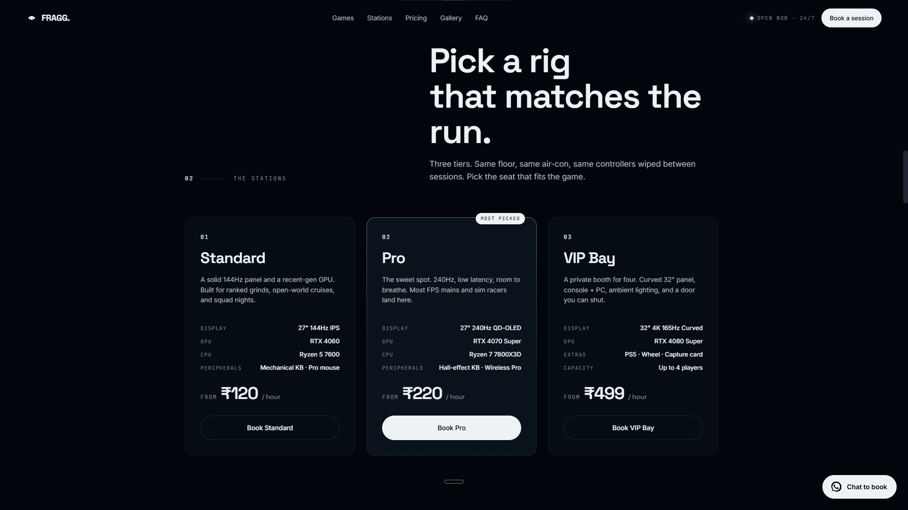
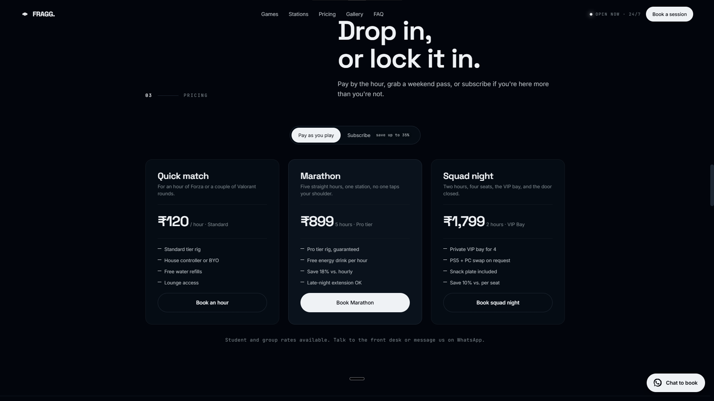
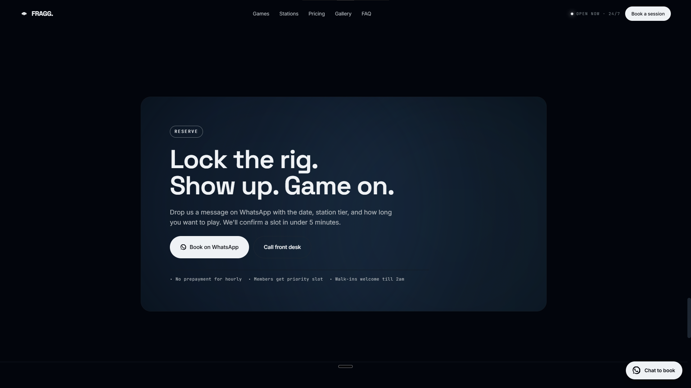

# FRAGG — Gaming Cafe Landing Page

A cinematic single-page site for a gaming cafe built around one idea: gamers don't want to read a brochure, they want to see the setup and book a seat.

🔗 **Live:** [REPLACE_WITH_ACTUAL_URL]

## Preview


*Dark-themed hero with glowing accents, live station count, and scrolling game marquee.*


*Cover art grid displaying the full game library with genre tags and hover effects.*


*Three-tier station cards with hardware specs, pricing, and booking buttons.*


*Pricing section with hourly and monthly subscription plan options.*


*Direct WhatsApp and call booking links for quick session reservation.*

## About

FRAGG is a concept landing page for a high-end gaming cafe — the kind of place with 240Hz rigs, dedicated console bays, and a library that runs deeper than the usual FIFA-and-Valorant rotation. I wanted the page itself to feel like walking into the place: dark theme, glowing accents, a hero that leads straight into the games library instead of a wall of marketing copy. No sign-up forms, no dashboards — just enough to get someone from "curious" to "booked" in a couple of taps.

## What's on the page

- **Hero** — the pitch in one screen: stations, refresh rate, title count, tonight's booking status
- **Trusted by marquee** — a scrolling strip of the titles in rotation (GTA V, God of War, Forza Horizon 5, and more)
- **Games grid** — cover art cards for the current library
- **Stations** — Standard / Pro / VIP Bay tiers with per-hour pricing and specs
- **Gallery** — photos of the floor, the rigs, the peripherals
- **FAQ** — the questions people actually ask before showing up
- **Booking** — WhatsApp and call links, no form to fill out

## Built with


- Vanilla HTML/CSS/JS — no framework, no build step
- Scroll-triggered reveal animations via IntersectionObserver
- WhatsApp deep links (`wa.me`) for booking instead of a backend form

## Why I built it this way

Booking flow is entirely WhatsApp and `tel:` links, not a form. For a gaming cafe, most walk-in-style bookings actually happen over chat anyway — someone messages, asks if a VIP bay is free tonight, and books in the same thread. Building a form with a backend would've added complexity nobody asked for; the WhatsApp link already pre-fills the message with the station they clicked on, so it does the job in one tap.

The page originally had a custom glowing cursor that followed the mouse — looked nice in isolation, but on a content-heavy page like this it kept pulling attention away from the actual games and pricing, especially with the marquee already having motion. Pulled it out and kept the animation budget for the reveal-on-scroll sections instead.

## Running it locally

```
FRAGG-Gaming-Cafe/
├── index.html
├── css/
│   └── style.css
├── js/
│   └── script.js
└── assets/
```
No build step — just open `index.html` in a browser.

## Status

Demo/concept build. Contact details, pricing, and booking links are illustrative.
